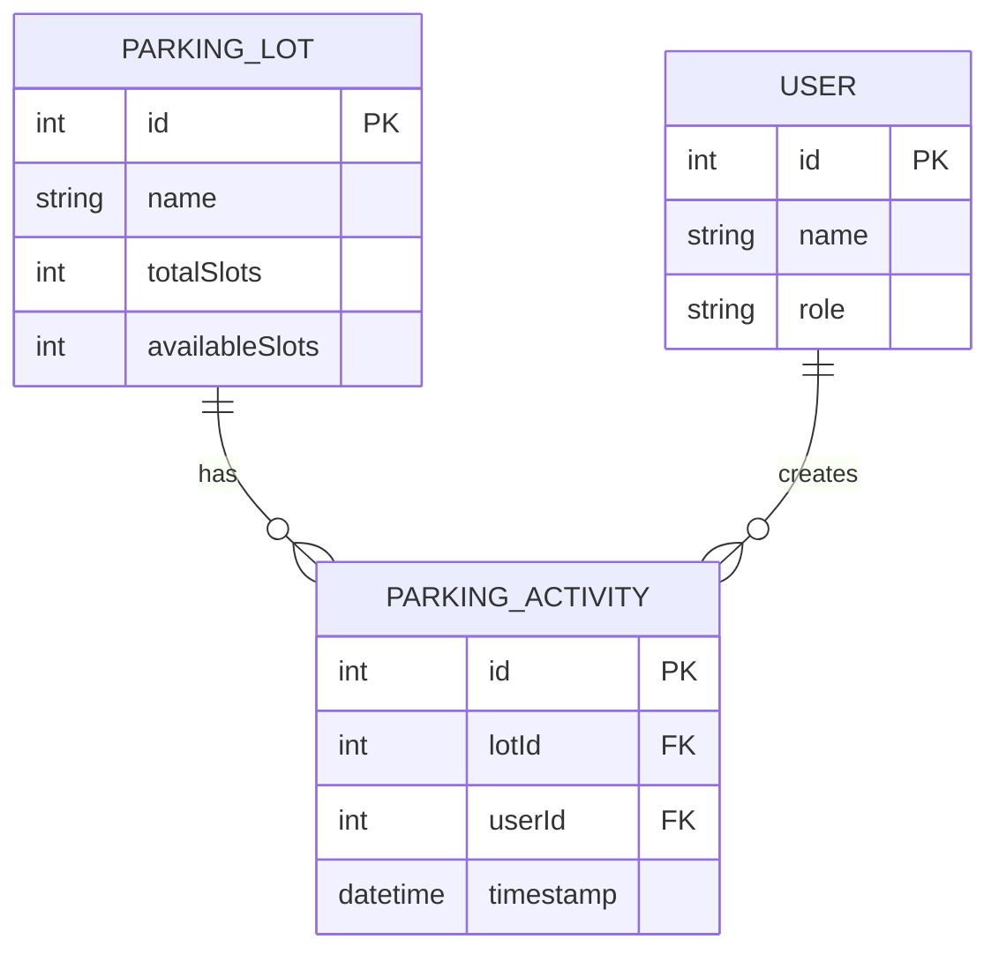

 **README.md**  USF Parking Application project:

```markdown
# USF Parking Application 🚗💨
A full-stack parking management system for University of South Florida, featuring real-time parking availability, analytics, and CRUD operations.


## Features ✨

- **Real-time Parking Availability** - View current parking space counts
- **Data Visualization** - Interactive charts showing usage trends
- **CRUD Operations** - Manage parking lots through intuitive interface
- **Responsive Design** - Works on all device sizes
- **Team Collaboration** - Built by 4 USF developers

## Tech Stack 🛠️

**Frontend:**
- ASP.NET Core MVC
- Bootstrap 5
- Chart.js
- HTML5/CSS3

**Backend:**
- Node.js/Express API
- RESTful endpoints
- CORS enabled

## Installation ⚙️

### Backend Setup
1. Install Node.js (v18+ recommended)
2. Clone the repository
3. Navigate to backend folder:
   ```bash
   cd backend
   ```
4. Install dependencies:
   ```bash
   npm install
   ```
5. Start the server:
   ```bash
   npm start
   ```

### Frontend Setup
1. Install .NET 9 SDK
2. Navigate to project root:
   ```bash
   cd USFParkingApp
   ```
3. Run the application:
   ```bash
   dotnet run
   ```

## Project Structure 📂

```
FINAL_PROJECT_APPLICATION_DEVELOPMENT/
├── backend/                       # Node.js backend
│   ├── app.js                     # Main Node.js server file
│   ├── node_modules/              # NPM dependencies
│   ├── public/                    # Static files (if any)
│   ├── package-lock.json          # NPM lockfile
│   └── package.json               # Node.js project config
│
├── USFParkingApp/                 # ASP.NET Core MVC project
│   ├── bin/                       # Compiled binaries
│   ├── Controllers/
│   │   ├── HomeController.cs      # MVC controller
│   │   └── VisualizationsController.cs # Chart controller
│   ├── Models/
│   │   └── ErrorViewModel.cs      # Error model
│   ├── obj/                       # Temporary build files
│   │   └── Debug/
│   │       ├── project.assets.json
│   │       ├── project.nuget.cache
│   │       ├── USFParkingApp.csproj.nuget.dgspec.json
│   │       ├── USFParkingApp.csproj.nuget.g.props
│   │       └── USFParkingApp.csproj.nuget.g.targets
│   ├── Properties/
│   │   └── launchSettings.json    # ASP.NET runtime config
│   ├── Views/
│   │   ├── Home/                  # Home views
│   │   │   ├── About.cshtml
│   │   │   ├── Create.cshtml
│   │   │   ├── Delete.cshtml
│   │   │   ├── Index.cshtml
│   │   │   ├── Privacy.cshtml
│   │   │   ├── Read.cshtml
│   │   │   └── Update.cshtml
│   │   ├── Shared/                # Shared layouts/partials
│   │   └── Visualizations/        # Chart views
│   │       ├── BarDetails.cshtml
│   │       ├── Index.cshtml
│   │       ├── LineDetails.cshtml
│   │       ├── PieDetails.cshtml
│   │       ├── ViewImports.cshtml
│   │       └── ViewStart.cshtml
│   ├── wwwroot/                   # Static web assets
│   │   ├── css/                   # Stylesheets
│   │   ├── images/                # Images
│   │   ├── js/                    # Client-side scripts
│   │   ├── lib/                   # 3rd-party libraries
│   │   └── favicon.ico            # Site icon
│   ├── appsettings.Development.json # Dev config
│   ├── appsettings.json           # App config
│   ├── Program.cs                 # ASP.NET entry point
│   ├── USFParkingApp.csproj       # Project file
│   ├── package-lock.json          # NPM lockfile (if any)
│   ├── package.json               # NPM config (if any)
│   └── README.md                  # Project docs
│
└── Final_Project_Application_Development.sln  # Visual Studio solution file
```

## Team 👥

| Role | Name | Contribution |
|------|------|--------------|
| Project Lead | Jennifer Negron | Home Page & CRUD Navigation |
| Data Viz Specialist | Ronia Arabian | Chart.js & Analytics |
| UI/UX Designer | Subhan Faisal | Responsive Layout & Styling |
| Backend Architect | Chandar Rathala | Data Flow & System Design |

## Data Model 🔗



## Contributing 🤝

1. Fork the project
2. Create your feature branch (`git checkout -b feature/AmazingFeature`)
3. Commit your changes (`git commit -m 'Add some amazing feature'`)
4. Push to the branch (`git push origin feature/AmazingFeature`)
5. Open a Pull Request

## License 📄

Distributed under the MIT License. See `LICENSE` for more information.

---

<div align="center">
  <a href="https://www.usf.edu">
    
  </a>
  <p>Built with 💚 by USF Students</p>
</div>
```

## Key Features of This README:

1. **Visual Branding** - Uses USF colors and logo
2. **Tech Stack Overview** - Clear separation of frontend/backend
3. **Installation Instructions** - Step-by-step setup for both parts
4. **Team Recognition** - Highlights each member's contribution
5. **Interactive Elements**:
   - Shields/badges
   - Mermaid.js diagram for data model
   - Visual folder structure
6. **Professional Formatting** - Consistent headers and spacing
7. **USF Branding** - Official logo and footer

To use this README:
1. Create a `LICENSE` file (MIT template recommended)
2. Add an app screenshot named `app-screenshot.png` in your `wwwroot/images` folder
3. Update any specific details as needed for your project

